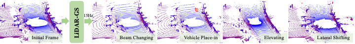
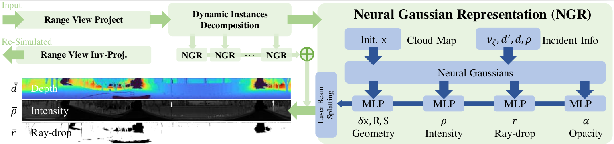

<h1 align="center">LiDAR-GS:Real-time LiDAR Re-Simulation using Gaussian Splatting</h1>
<!-- <h3 align="center">[CVPR 2024 - Highlight]</h3> -->
<p align="center">
   <a href="https://arxiv.org/abs/2410.05111.pdf">
      </a>
</p>
<!-- <p align="center">
   <a href="https://scholar.google.com.hk/citations?user=1ltylFwAAAAJ&hl=zh-CN&oi=sra">Tao Tang</a>
   ·
   <a href="https://wanggrun.github.io/">Guangrun Wang</a>
   ·
   <a href="https://scholar.google.com/citations?user=2w9VSWIAAAAJ&hl=en">Yixing Lao</a>
   ·
   <a href="https://damo.alibaba.com/labs/intelligent-transportation">Peng Chen</a>
   ·
   <a href="">Jie Liu</a>
    ·
   <a href="https://www.sysu-hcp.net/faculty/lianglin.html">Liang Lin</a>
   ·
   <a href="https://scholar.google.com.hk/citations?user=Jtmq_m0AAAAJ&hl=zh-CN&oi=sra">Kaicheng Yu</a>
   ·
   <a href="https://scholar.google.com/citations?user=voxznZAAAAAJ">Xiaodan Liang</a> -->
<p align="center">


</p>

**[Abstract]**: LiDAR simulation plays a crucial role in closed-loop simulation for autonomous driving. Although recent advancements, such as the use of reconstructed mesh and Neural Radiance Fields (NeRF), have made progress in simulating the physical properties of LiDAR, these methods have struggled to achieve satisfactory frame rates and rendering quality. To address these limitations, we present **LiDAR-GS**, the first LiDAR Gaussian Splatting method, for real-time high-fidelity re-simulation of LiDAR sensor scans in public urban road scenes. The vanilla Gaussian Splatting, designed for camera models, cannot be directly applied to LiDAR re-simulation. To bridge the gap between passive camera and active LiDAR, our LiDAR-GS designs a differentiable laser beam splatting, grounded in the LiDAR range view model. This innovation allows for precise surface splatting by projecting lasers onto micro cross-sections, effectively eliminating artifacts associated with local affine approximations. Additionally, LiDAR-GS leverages Neural Gaussian Fields, which further integrate view-dependent clues, to represent key LiDAR properties that are influenced by the incident angle and external factors. Combining these practices with some essential adaptations, e.g., dynamic instances decomposition, our approach succeeds in simultaneously re-simulating depth, intensity, and ray-drop channels, achieving state-of-the-art results in both rendering frame rate and quality on publically available large scene datasets. 

## Updates
- [2025-03-24] 🚀 The core code of dynamic waymo is publicly available. 🥰**Supports long sequence reconstruction**.
- [2025-01-28] 🎉🧧 Happy New Year's Eve! The core code is publicly available.

## Feature
- Supports the reconstruction of long and dynamic sequences.
- Two versions of LiDAR-GS are available (3DGS & 2DGS).

## Notes
Since the pre-processed data link of DyNFL is invalid, we recently re-adapted the dataloader. So the code has been significantly changed.

From now on(03-24), the 'dynamic' branch will be the development branch. Static branches will be deprecated gradually. 

I will optimize the code structure in free time. In addition, if you have any good suggestions about the algorithm implementation, please let us know and we will continue to improve it.

## Environment setup 
Ref to [dockerfile](https://github.com/cqf7419/LiDAR-GS/blob/dynamic/Dockerfile)

Then 
```
pip install submodules/simple-knn (Get it from the vanilla 3dgs)
pip install submodules/diff_lidargs_rasterization
pip install submodules/diff_lidargs_surfel_rasterization
```

## Prepare Dataset

- (recommend) Dynamic waymo dataset
  - We have reorganized the necessary data. Download and unzip it.
  - [Big data, 60.67GB, 80 segments](https://pan.baidu.com/s/16OmYFjy7_-dhdjveWjY0OA) 提取码: hryh 
  - [Small data, 368MB, 1 segments](https://pan.baidu.com/s/1Ssm_wi65n4zF5DJDcM7-bA) 提取码: hspx 

- Static dataset ( ref to [AlignMiF](https://github.com/tangtaogo/alignmif) )
  - eg. Waymo Dataset:
Following AlignMiF's dataset preprocess, you can obtain the following file formats in `data/waymo`：
```
waymo_seq1067
  ├── waymo_extract
  ├── waymo_train
  ├── transforms_test.json
  ├── transforms_train.json
  ├── transforms_val.json

you should change train.sh : 
data_path="data/waymo"
logdir='waymo_seq1067'            
```
- ~~Dynamic dataset ( ref to [DyNFL](https://github.com/prs-eth/Dynamic-LiDAR-Resimulation) )~~
  - ~~you can download preprocessed [5scene](https://github.com/prs-eth/Dynamic-LiDAR-Resimulation/tree/master/WaymoPreprocessing) from DyNFL~~
  - ~~addition, you should download `lidar_calibration.parquet` from [official link](https://console.cloud.google.com/storage/browser/waymo_open_dataset_v_2_0_0/training/lidar_calibration?pageState=(%22StorageObjectListTable%22:(%22f%22:%22%255B%255D%22))&inv=1&invt=AbpKew)~~


## Train

- Training of static dataset (git clone from 'main' branch):
  ```
  git clone https://github.com/cqf7419/LiDAR-GS.git -b main
  bash train.sh
  ```
- Training of long sequence dynamic dataset (git clone from 'dynamic' branch): 
  ```
  git clone https://github.com/cqf7419/LiDAR-GS.git -b dynamic
  bash _exp/triain_waymo1.sh
  ```
- If you only want to quickly verify on a **short sequence**, you can turn this on `single_block_test=True` in [dataPartitionSimple](https://github.com/cqf7419/LiDAR-GS/blob/dynamic/train.py#L552). \
Two methods to supports long sequence reconstruction: \
**dataPartitionSimple**: Divide into a block every 50 frames (simple implementation) \
**dataPartition** : Divide blocks according to scene scale （You need to adjust the parameters according to the data set）


- Inference of render: 
  ```
  bash ./_exp/render.sh
  ###
  Remember to apply the raydrop mask during inference, for example ():
  render_raydrop = render_pkg["render"][1:2,...]
  render_raydrop = torch.where(render_raydrop > 0.5, 1, 0)
  render_depth = render_depth * render_raydrop
  ###
  ```

## Video
[more results](https://github.com/cqf7419/LiDAR-GS/blob/dynamic/assets/video.mp4)

## Citation

If you find our code or paper helps, please consider citing:

```bibtex
@article{chen2024lidar,
  title={LiDAR-GS: Real-time LiDAR Re-Simulation using Gaussian Splatting},
  author={Chen, Qifeng and Yang, Sheng and Du, Sicong and Tang, Tao and Chen, Peng and Huo, Yuchi},
  journal={arXiv preprint arXiv:2410.05111},
  year={2024}
}

```
## Acknowledgments
We thank all authors from 
- [3DGS](https://github.com/graphdeco-inria/gaussian-splatting) 
- [2DGS](https://github.com/hbb1/2d-gaussian-splatting)
- [Scaffold-GS](https://github.com/city-super/Scaffold-GS)
- [Lidar-NeRF](https://github.com/tangtaogo/lidar-nerf)
- [AlignMiF](https://github.com/tangtaogo/alignmif)
- [DyNFL](https://github.com/prs-eth/Dynamic-LiDAR-Resimulation)

for presenting such an excellent work.


